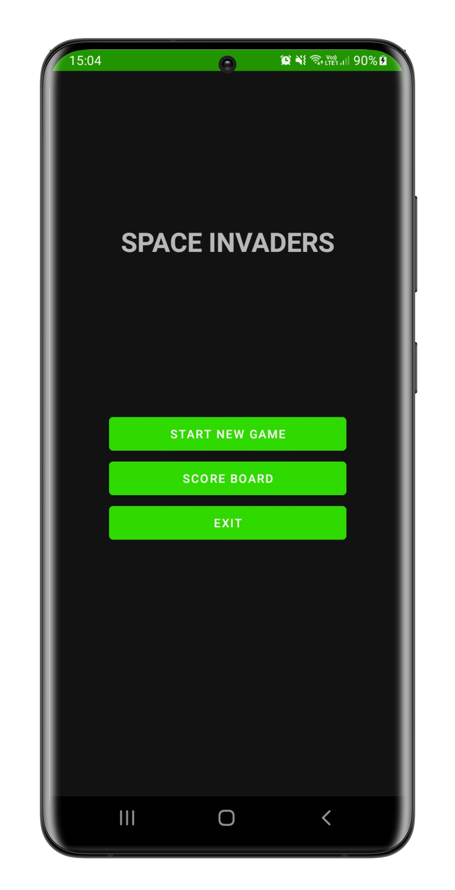
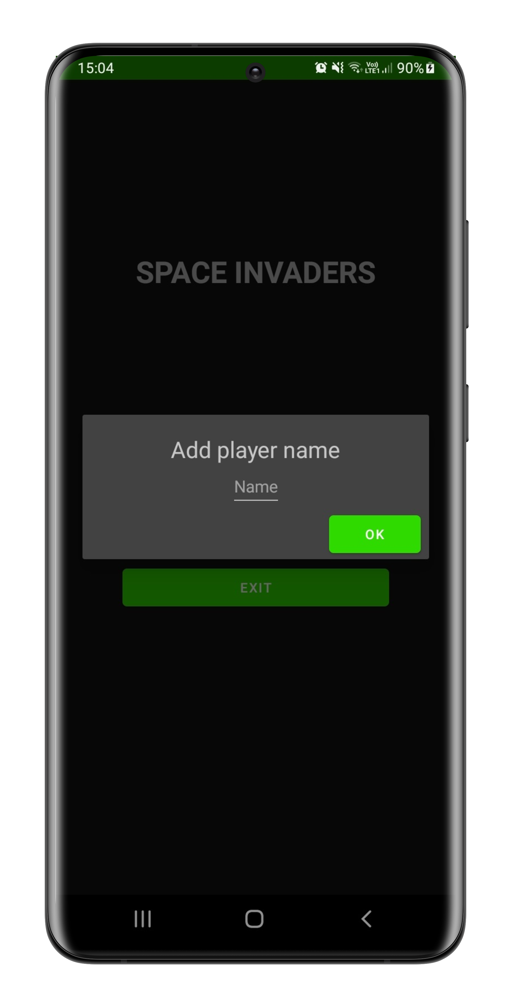
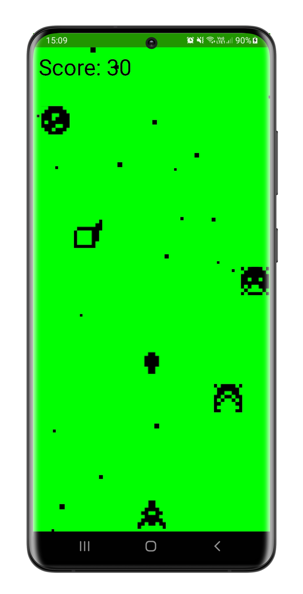
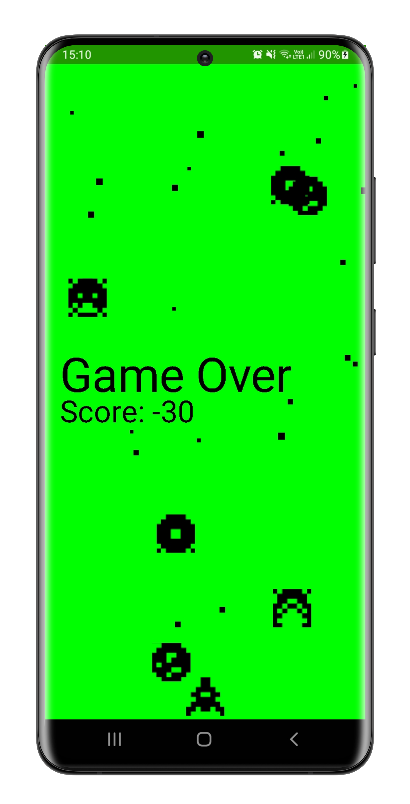
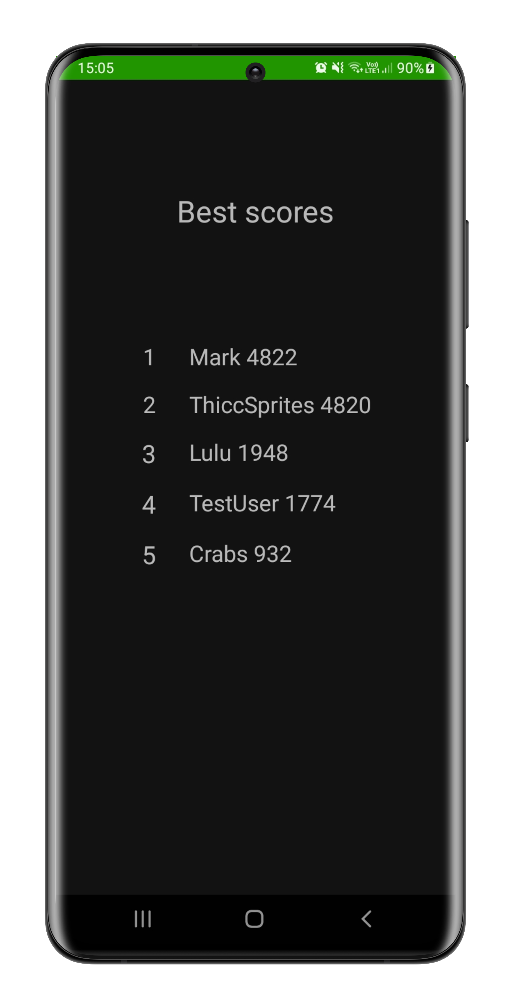

# SpaceInvaders

Homework for **Mobile- and Web-based Software** course at the *Budapest University of Technology and Economics*.

## Motivations

I had a childhood memory of playing with a similar game on my grandparent's phone, and I wanted to relive the feeling.

## Main Functions

- Main menu with options to start the game, view the leaderboard or exit the game
- Using gyroscope, move the player's ship
- Tap to fire a bullet
- Player dies upon collision with enemy
- Player gains points upon shooting down an enemy, loses some for missing or lettin them through
- After the game, score is uploaded to remote database, top list is updated if needed

gyroscope
sprite sheet

## Explored Technologies
- Activity and Fragment classes
    - displaying different views
- Dialog Fragment
    - validation of user input
- Gyroscope
    - movement control for player
- Firestore
    - remote data storage
- Canvas
- Surface View
- Surface Holder
- Intent

## Presentational Images

- Opening View of Application, Main Menu. 

- Player Name selecting pop-up window

- Active Gameplay

- Game Over Screen

- Top List Screen
